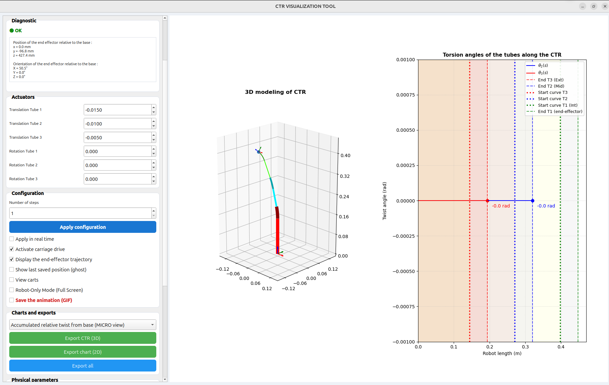
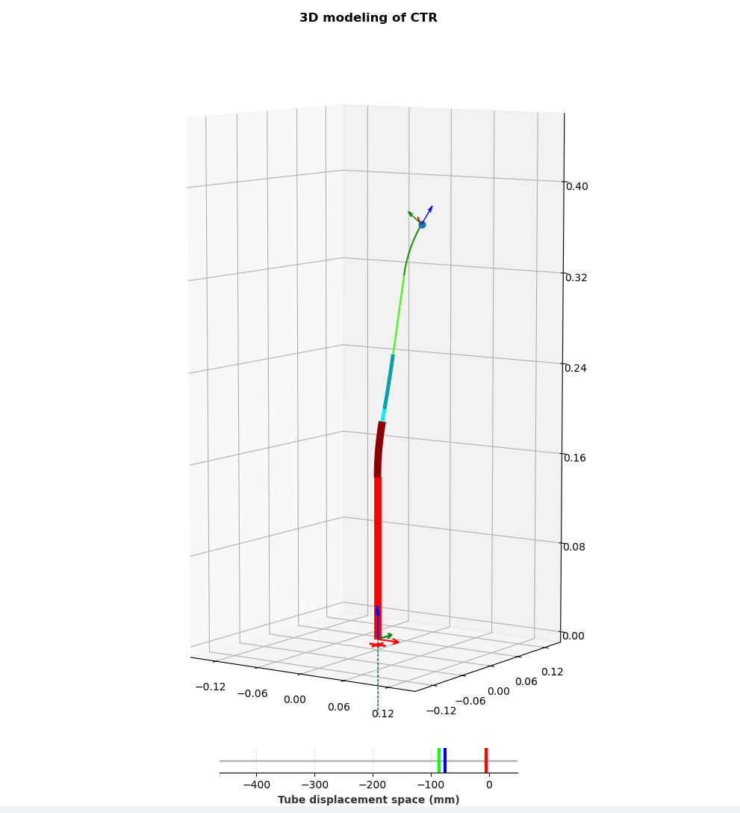
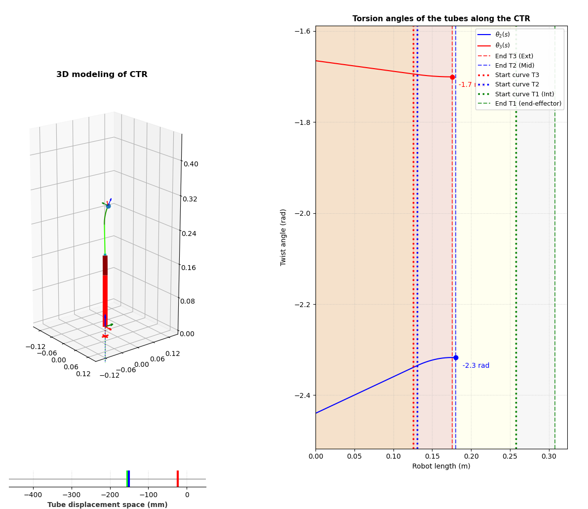
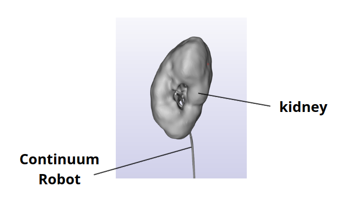

# Continuum Robot 3D


## Overview

**Continuum Robot 3D** is an interactive visualization and control platform for **Concentric Tube Robots (CTR)**.

Built on top of the open-source CTR solver developed by the TIMC-GMCAO team, this project introduces a complete software environment for robot visualization, interactive control, scientific analysis, VTK-based data export, and integration within the CamiTK medical imaging framework.

The objective is to facilitate the study and development of continuum robots for research, education, and computer-assisted intervention applications.

```markdown
## Academic Context

This project was developed during a two-month research internship at the TIMC laboratory, within the GMCAO team.

The objective was to provide an interactive environment for the visualization, analysis, and navigation of Concentric Tube Robots (CTR), while facilitating their integration into medical imaging workflows through CamiTK.
```

## Screenshots

### Main Interface



### Robot Visualization



### Accumulated relative twist from base Analysis



### Camitk Extension




## Project Components

The project is composed of three complementary modules:

### CTR Solver

A C++ implementation responsible for computing the equilibrium configuration of concentric tube robots.

### Visualization Toolkit

A Python-based graphical environment for simulation, analysis, and visualization.

### CamiTK Extension

The project includes a dedicated CamiTK extension allowing the integration of Concentric Tube Robots into medical imaging workflows.

Features:

- Import and visualization of robot geometries in CamiTK
- Registration of the robot with patient-specific anatomical data
- Navigation of the robot relative to organs and medical images
- Visualization of robot trajectories in a clinical environment
- Support for image-guided robotic procedures

This extension aims to facilitate the use of continuum robots in computer-assisted intervention and surgical planning scenarios.

---

## Features

### Interactive Control

* Real-time modification of tube rotations and translations
* Direct control of robot configuration
* Instant visualization of robot shape evolution

### 3D Visualization

* Interactive 3D rendering of the robot backbone
* Visualization of individual tubes
* Camera navigation and inspection tools
* Curvature highlighting

### VTK Integration

* Generation of VTK objects
* Export for scientific visualization tools
* Compatibility with CamiTK and VTK-based workflows

### CamiTK Integration

- Integration inside the CamiTK framework
- Robot navigation relative to anatomical structures
- Visualization alongside medical images
- Support for image-guided intervention workflows

### Scientific Analysis

* Position plots
* Orientation plots
* end-effector history
* Accumulated relative twist from base
* Curvature analysis
* Tube configuration visualization

### Data Processing

* Loading robot parameters from CSV files
* Communication with the C++ solver
* Automatic extraction of simulation results
* Numerical post-processing


## Installation

### Requirements

* Ubuntu 24.04 LTS
* Python 3.11+
* CMake
* GCC / G++
* Git

### Clone Repository

```bash
git clone https://github.com/Marouane911/Continuum-Robot-3D.git

cd Continuum-Robot-3D
```

### Create Python Environment

```bash
python3 -m venv .venv

source .venv/bin/activate
```

### Install Dependencies

```bash
pip install -r requirements.txt
```

Typical dependencies include:

```bash
numpy
matplotlib
pyqt5
vtk
scipy
```

## Building the Solver

```bash
mkdir build

cd build

cmake ..

make -j$(nproc)
```

---

## Usage

### Visualization Toolkit

Launch the graphical interface:

```bash
python main.py
```

or

```bash
python Toolkit/gui/main_app.py
```

Depending on the repository version.


### CamiTK Extension

Launch the graphical interface:

```bash
python camitk.py
```

or

```bash
python Toolkit/gui/camitk.py
```

Depending on the repository version.

---


## Workflow

1. Load robot parameters.
2. Modify tube configurations.
3. Execute the solver.
4. Retrieve backbone coordinates.
5. Visualize the robot in 3D.
6. Analyze orientation and curvature plots.
7. Export results if needed.

---

## Mathematical Background

Concentric Tube Robots (CTR) are continuum robots composed of several pre-curved elastic tubes inserted inside one another.

The robot shape is determined by:

* Tube geometry
* Curvature profiles
* Elastic properties
* Relative tube rotations
* Relative tube translations

The solver computes the resulting equilibrium configuration and reconstructs the robot backbone in three-dimensional space.

---

## Repository Structure

```text
Continuum-Robot-3D/
│
├── Modeling-and-Control-of-Concentric-Tube-Robots/
│   ├── demo/
│   ├── Library/
│   ├── parameters/
│   └── src/
│
├── Toolkit/
│   ├── gui/
│   │   ├── ctr_pilot/
│   │   ├── camitk.py
│   │   ├── ctr_data.py
│   │   ├── ctr_graph.py
│   │   ├── ctr_loader.py
│   │   ├── ctr_solver.py
│   │   ├── ctr_visualizer.py
│   │   └── ctr_vtk_export.py
│   │
│   └── python/
│
├── images/
├── requirements.txt
└── README.md
```


## Applications

Possible applications include:

* Medical robotics
* Surgical navigation
* Robot design studies
* Continuum robot research
* Educational demonstrations
* Kinematic analysis

---

## Future Improvements

* Real-time simulation
* GPU acceleration
* Improved mesh generation
* ROS integration
* Multi-robot support
* Advanced path planning
* Improved CamiTK interoperability

---

## Credits

This project builds upon the open-source repository **Modeling-and-Control-of-Concentric-Tube-Continuum-Robots**, developed by the TIMC-GMCAO team for the modeling and control of Concentric Tube Continuum Robots (CTCR). The original solver is associated with the publication:

> Quentin Boyer, Sandrine Voros, Pierre Roux, François Marionnet, Kanty Rabenorosoa, and M. Taha Chikhaoui,
> *On High Performance Control of Concentric Tube Continuum Robots through Parsimonious Calibration*,
> IEEE Robotics and Automation Letters (RA-L), 2024.

This repository extends the original project by providing:

- an interactive Python visualization toolkit;
- advanced scientific visualization and analysis tools;
- VTK export utilities;
- a CamiTK extension for image-guided intervention workflows;
- a graphical user interface for interactive robot control.

---


## Acknowledgements

This project was developed during a two-month research internship at the TIMC laboratory (UMR 5525), within the GMCAO (Computer-Assisted Medical Interventions) team.

I would like to sincerely thank the entire GMCAO team for their warm welcome and for providing an inspiring research environment throughout this internship.

I am especially grateful to **Taha Chikhaoui** and **Joseph Massin** for their supervision, guidance, technical expertise, and continuous support during the development of this project.

Their advice and encouragement were invaluable to the successful completion of this work.
---

## Author

**Marouane Keteb**

Université Grenoble Alpes (UGA)

B.Sc. Student in Applied Mathematics and Computer Science

Computer Vision and Medical Robotics Research Enthusiast

GitHub: https://github.com/Marouane911

---

## Citation

If you use this project in academic work, please cite the repository:

```bibtex
@misc{continuumrobot3d,
  author = {Marouane Keteb},
  title = {Continuum Robot 3D},
  year = {2026},
  publisher = {GitHub},
  url = {https://github.com/Marouane911/Continuum-Robot-3D}
}
```

---

## License

This project is distributed under the MIT License.

See the LICENSE file for details.